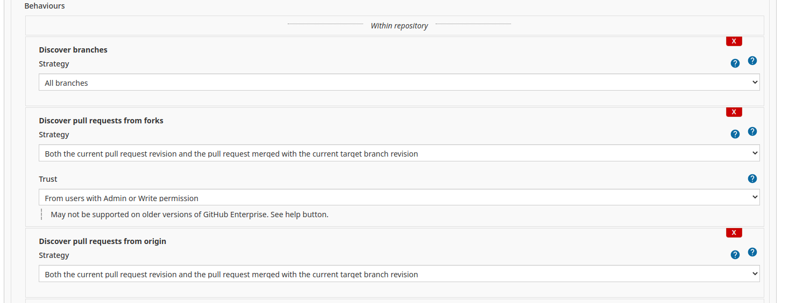
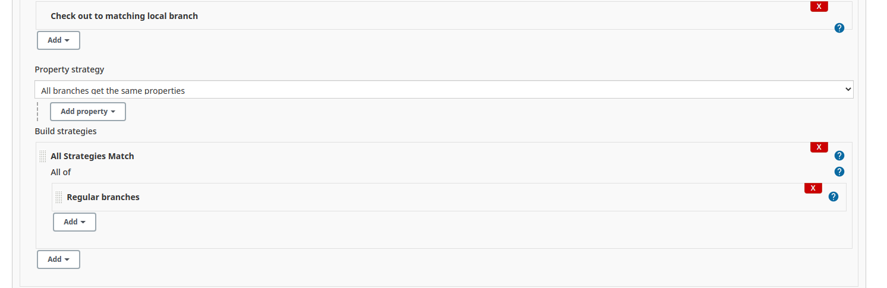

# SRE Orderbook pipeline build

This is an example build job for the orderbook application pipeline.  This branch contains the pipeline and docker configuration for the application and database.

## Setting Up Blue Ocean pipeline

This is documented in Day 1, Module 3 - Jenkins.pptx

After setting up the Multibranch pipeline it will do the first scan and build automatically, but it doesn't poll the SCM and automatically build if someone pushes to their branch.  For this to happen you need to;

1. Got to https://jenkins.computerlab.online/job/sre-orderbook
2. Click **Configure**
3. Scroll down to behaviours and set the information as follows;
   
4. Scroll down to **Property strategy** and make the following changes;
   
   NOTE: For this you will need to click **Add** under **Build strategies** and select **All Strategies Match** to get the first part.
